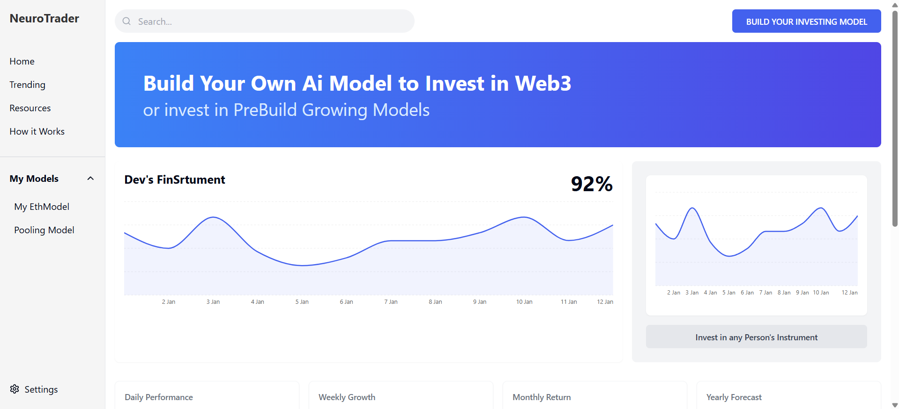
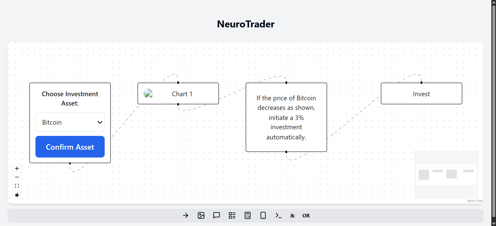

# HackIndia Spark 7 2025 – MetaMinds 🚀  
## NeuroTrader – Design Your Own AI Trading Model, No Code Required

**NeuroTrader** is a no-code platform that empowers users to design intelligent, AI-driven investment strategies — with zero prior coding experience.

---

### 🌟 Why NeuroTrader?

Unlike traditional tools that rely on rigid, pre-built models, **NeuroTrader** lets you *create custom AI trading models* from scratch. With a clean drag-and-drop interface, users can:

- Visually map out strategies
- Describe trading logic in natural language
- Optionally embed Python code for deeper customization

---

### ⚙️ How It Works

1. **Design Your Strategy**  
   Use an intuitive, drag-and-drop interface to build your AI model — visually and naturally.

2. **Test With Real Market Data**  
   NeuroTrader runs your strategy against real-time and historical market data.

3. **Monetize**  
   If your strategy performs well, it becomes shareable. Let others invest through your model and earn from its success.

---

### 📸 Screenshots

#### 🧩 App UI – Strategy Designer (App.tsx)

#### 🧠 App UI – Model Settings Panel (App.tsx)

#### 🐍 Backend – Python Logic Processing

> _Place these images in a `/screenshots/` folder in your repo._

---

### 🧠 Built For:

- **AI Enthusiasts**
- **Aspiring Quant Traders**
- **Investors who want control**
- **Hackathon Innovators**

---

### 🛠️ Tech Stack

- **Frontend**: React (TypeScript)
- **Backend**: Python (FastAPI / Flask)
- **AI Engine**: LLaMA 2 via Ollama
- **Data**: Real
